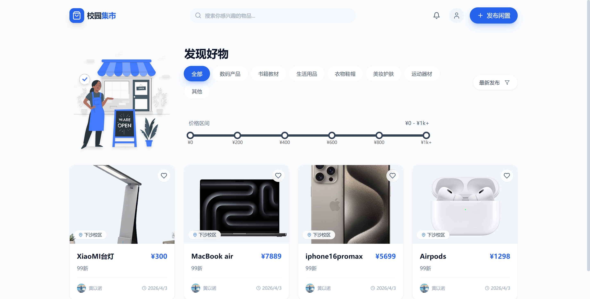
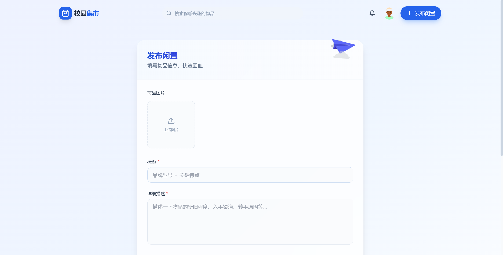
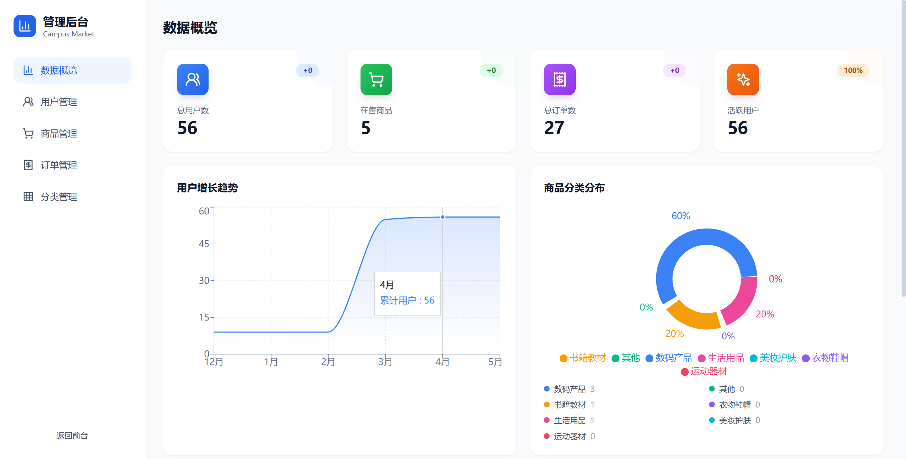

# Campus Market

<p align="center">
  <strong>A campus second-hand trading platform built on TypeScript Monorepo</strong>
</p>

<p align="center">
  
  
  
  
  
  
  
  
</p>

**Language:** English | [简体中文](./README-zh-CN.md)

---

## Table of Contents

- [Overview](#overview)
- [Highlights](#highlights)
- [Features](#features)
- [Screenshots](#screenshots)
- [Tech Stack](#tech-stack)
- [Architecture](#architecture)
- [Directory Structure](#directory-structure)
- [Quick Start](#quick-start)
- [Docker Deployment](#docker-deployment)
- [Testing & Quality](#testing--quality)
- [CI/CD](#cicd)
- [Database Design](#database-design)
- [Roadmap](#roadmap)
- [Resume Description](#resume-description)
- [License](#license)

---

## Overview

Campus Market is a second-hand goods trading platform for university students. Users can list idle items, browse the marketplace, filter by category or keyword, complete transactions, manage orders, and communicate with the other party through in-app messaging.

**This is not a simple front-end demo.** It is a complete full-stack project featuring:

- **Frontend/Backend separation** — React SPA communicates with an Express REST API via Axios and JWT
- **Shared contract layer** — `packages/shared` keeps Zod schemas and TypeScript DTOs in sync between the two sides; any breaking interface change surfaces at compile time
- **Database-driven** — Prisma ORM + PostgreSQL with a complete data model, indexed queries, and a migration chain
- **Multi-layer testing** — Jest (backend unit/integration) + Vitest (frontend component/logic) + Docker API end-to-end regression
- **Containerized deployment** — Docker Compose orchestrates the frontend (nginx), backend (Node.js), and database (PostgreSQL); one command brings up the full stack locally

---

## Highlights

- **TypeScript Monorepo** — npm workspaces manages `frontend` / `backend` / `packages/shared` as a single repository; lint, typecheck, test, and build all run from the root
- **Shared Zod schemas** — `@campus-market/shared` provides both TypeScript DTO types and Zod validation schemas, so frontend form validation and backend request validation reuse the same definitions
- **Dual-token auth** — JWT access token stored in memory (XSS-safe), refresh token in an `httpOnly` cookie (JS-invisible); supports silent token refresh and token rotation
- **Product full lifecycle** — create with multi-image upload, category filtering, keyword search, view count, and status management
- **Order state machine** — buyer places order → seller confirms/rejects → transaction complete; price snapshot preserves historical accuracy
- **In-app messaging** — buyer and seller build a dedicated session per product; supports read receipts and message recall
- **Favorites** — toggle-based, idempotent favorite/unfavorite
- **Admin panel** — role-gated (`ADMIN`) dashboard covering user, product, and order management
- **Layered architecture** — Router → Controller → Service → Prisma; each layer has a single responsibility and services are independently testable
- **Engineering standards** — ESLint + Prettier + Husky + lint-staged (pre-commit auto-format and lint fix)
- **Docker multi-stage build** — frontend served as static assets via nginx with `/api` reverse proxy; backend image keeps production dependencies only
- **GitHub Actions** — code quality gate (lint → typecheck → test → build) + full Docker stack regression, with automatic artifact upload

---

## Features

| Module             | Description                                                                                    | Status  |
| ------------------ | ---------------------------------------------------------------------------------------------- | ------- |
| User Auth          | Register, login, logout, JWT + refresh token, cookie management                                | ✅ Done |
| User Profile       | Avatar upload, nickname / department / grade / bio editing                                     | ✅ Done |
| Product Listing    | Create product, multi-image upload, category, price                                            | ✅ Done |
| Product Management | Edit, delist / relist, delete                                                                  | ✅ Done |
| Product Browsing   | Paginated list, category filter, price range, keyword search, product detail                   | ✅ Done |
| Favorites          | Add / remove favorites, favorites list                                                         | ✅ Done |
| Orders             | Create order, order list, status transitions (pending → completed / cancelled), price snapshot | ✅ Done |
| Messaging          | Buyer–seller session per product, send messages, read receipts, recall                         | ✅ Done |
| File Upload        | Product images and avatar upload, static file serving                                          | ✅ Done |
| Admin Panel        | User / product / order list and management (ADMIN role required)                               | ✅ Done |
| Automated Testing  | Backend unit/integration (Jest), frontend component/logic (Vitest), Docker API regression      | ✅ Done |
| Docker Deployment  | One-command Compose startup; nginx reverse proxy for `/api`                                    | ✅ Done |

---

## Screenshots

### Home


### Marketplace



### Publish Product



### Admin Dashboard



---

## Tech Stack

| Category        | Technologies                                                                          |
| --------------- | ------------------------------------------------------------------------------------- |
| Frontend        | React 18, Vite 5, TypeScript 5, Tailwind CSS 3, React Router v6, Axios, Framer Motion |
| Backend         | Node.js 20, Express 4, TypeScript 5                                                   |
| Database        | PostgreSQL 16, Prisma 6 (`@prisma/adapter-pg`)                                        |
| Auth            | JWT (`jsonwebtoken`), bcrypt, httpOnly Cookie                                         |
| Shared Contract | `packages/shared`, Zod 3                                                              |
| Testing         | Jest 29, Supertest, Vitest 1, @testing-library/react                                  |
| Tooling         | ESLint 8, Prettier 3, Husky 9, lint-staged 15                                         |
| Containers      | Docker, Docker Compose, nginx                                                         |
| CI/CD           | GitHub Actions                                                                        |

---

## Architecture

```
                              ┌─────────────────────────────────────────────┐
                              │             packages/shared                  │
                              │      Zod Schemas  ·  TypeScript DTOs         │
                              └───────────────┬─────────────────┬───────────┘
                                              │                 │
                         ┌────────────────────┘                 └─────────────────────┐
                         ▼                                                             ▼
  ┌──────────┐    ┌──────────────────────────┐   HTTP /api/*   ┌─────────────────────────────┐
  │          │    │        frontend/          │ ─────────────► │         backend/             │
  │  Browser │───►│  React 18 · Vite · TS     │                │  Express · TypeScript · JWT  │
  │          │    │  Tailwind CSS · Router v6  │ ◄─────────────│  Multer · Zod · bcrypt       │
  └──────────┘    └──────────────────────────┘   JSON res      └──────────┬──────────────────┘
                              │                                             │
                      nginx /uploads                               ┌────────▼────────┐
                      static proxy                                 │   Prisma ORM    │
                                                                   └────────┬────────┘
                                                                            │
                                                                   ┌────────▼────────┐
                                                                   │   PostgreSQL    │
                                                                   └─────────────────┘

  ╔══════════════════════════════════════════════════════════════════════════════════╗
  ║  DevOps                                                                          ║
  ║                                                                                  ║
  ║  Docker Compose ──► nginx (port 80) + Node.js (3000) + PostgreSQL (5432)        ║
  ║                                                                                  ║
  ║  GitHub Actions  ──► lint → typecheck → test → build                            ║
  ║                            └──► Docker API regression (docker-acceptance.mjs)   ║
  ╚══════════════════════════════════════════════════════════════════════════════════╝
```

---

## Directory Structure

```text
Campus_Market-TypeScript/
├─ frontend/              # React + Vite SPA (Tailwind, Vitest, Dockerfile)
├─ backend/               # Express REST API (Prisma, Jest, Dockerfile)
├─ packages/
│  └─ shared/             # Shared Zod schemas and TypeScript DTO types
├─ scripts/               # Utility scripts (Docker acceptance, CI helpers)
├─ .github/workflows/     # GitHub Actions CI configuration
├─ .workflow/             # Gitee Go pipeline configuration
├─ docker-compose.yml     # Docker Compose orchestration
├─ .env.docker.example    # Docker environment variable template
└─ package.json           # npm workspaces root config
```

Sub-module architecture docs:

- [frontend/ARCHITECTURE.md](./frontend/ARCHITECTURE.md)
- [backend/ARCHITECTURE.md](./backend/ARCHITECTURE.md)

---

## Quick Start

### Prerequisites

- Node.js 20+
- npm 10+
- PostgreSQL 13+ — or skip this and use the Docker setup below

### 1. Install Dependencies

```bash
npm install
```

### 2. Configure Environment Variables

```bash
cp backend/.env.example backend/.env
cp frontend/.env.example frontend/.env
```

Required variables in `backend/.env`:

| Variable       | Description                                            |
| -------------- | ------------------------------------------------------ |
| `DATABASE_URL` | PostgreSQL connection string                           |
| `JWT_SECRET`   | JWT signing secret                                     |
| `FRONTEND_URL` | Frontend origin for CORS, e.g. `http://localhost:5173` |

### 3. Initialize the Database

```bash
npm --workspace campus-market-backend run prisma:deploy
npm --workspace campus-market-backend run prisma:generate
```

### 4. Start Development Servers

```bash
npm run dev
```

Both frontend and backend start in parallel via `concurrently`:

| Service      | URL                          |
| ------------ | ---------------------------- |
| Frontend     | http://localhost:5173        |
| Backend      | http://localhost:3000        |
| Health check | http://localhost:3000/health |

---

## Docker Deployment

One command to bring up the frontend (nginx), backend (Node.js), and database (PostgreSQL):

```bash
# 1. Copy the environment template
cp .env.docker.example .env

# 2. Edit .env — at minimum change the password and JWT_SECRET

# 3. Build and start
docker compose up --build -d
```

| Service     | URL                   |
| ----------- | --------------------- |
| Frontend    | http://localhost      |
| Backend API | http://localhost:3000 |
| PostgreSQL  | localhost:5432        |

```bash
docker compose logs -f        # stream logs
docker compose down           # stop
docker compose down -v        # stop and remove volumes (data lost)
```

> Full configuration details, initialization mechanism, and production notes: [docs/deployment.md](./docs/deployment.md)

---

## Testing & Quality

| Type              | Tool                       | Description                                                                      |
| ----------------- | -------------------------- | -------------------------------------------------------------------------------- |
| Code style        | ESLint + Prettier          | Unified formatting for TypeScript + React                                        |
| Commit check      | Husky + lint-staged        | pre-commit auto-format and ESLint fix (staged files only)                        |
| Type checking     | TypeScript 5               | End-to-end type validation across all workspaces                                 |
| Backend tests     | Jest 29 + Supertest        | Unit and integration tests for services, controllers, middlewares, routes        |
| Frontend tests    | Vitest 1 + Testing Library | Component rendering, utilities, and API request tests                            |
| Docker regression | Node.js `fetch`            | Spins up the full Compose stack and validates API endpoints from the client side |
| CI                | GitHub Actions             | Runs lint → typecheck → test → build + Docker regression automatically           |

```bash
npm run lint             # ESLint across all workspaces
npm run typecheck        # TypeScript check across all workspaces
npm test                 # Jest (backend) + Vitest (frontend)
npm run build            # Build: shared → backend → frontend
npm run test:acceptance  # Docker API end-to-end regression
```

Coverage thresholds: statements / lines / functions ≥ 80%, branches ≥ 70% (core business modules).

> Full acceptance testing details (three-layer breakdown, report paths, Gitee Go setup): [docs/testing-acceptance.md](./docs/testing-acceptance.md)

---

## CI/CD

**GitHub Actions** — `.github/workflows/ci.yml`

| Trigger              | When                              |
| -------------------- | --------------------------------- |
| `push` to `main`     | On every merge to the main branch |
| `push` to `codex/**` | AI-assisted development branches  |
| `pull_request`       | All PRs must pass before merging  |

| Job                   | Steps                                                                                                                 |
| --------------------- | --------------------------------------------------------------------------------------------------------------------- |
| `code-level-tests`    | lint → typecheck → test (unit / component / integration) → build; uploads coverage artifacts                          |
| `customer-regression` | Requires `code-level-tests` to pass; starts Docker Compose full stack, runs API regression, uploads acceptance report |

---

## Database Design

Core data models from `backend/prisma/schema.prisma`:

| Entity           | Description                                                                               |
| ---------------- | ----------------------------------------------------------------------------------------- |
| `User`           | Account record (student ID, phone, password hash, role, enabled flag)                     |
| `UserProfile`    | User profile (avatar, name, department, grade, credit score, bio)                         |
| `Product`        | Product listing (title, description, price, original price, category, status, view count) |
| `ProductImage`   | Product images (multi-image support with sort order)                                      |
| `Category`       | Product category                                                                          |
| `Order`          | Order record (buyer/seller/product refs, price snapshot, meet location and time)          |
| `ChatSession`    | Messaging session (unique per buyer + seller + product triple)                            |
| `ChatMessage`    | Message record (content, type, read status, recall flag)                                  |
| `Favorite`       | Favorite relationship (unique constraint on user × product)                               |
| `RefreshSession` | Refresh token session (hashed storage, supports token rotation and revocation)            |

---

## Roadmap

- Mobile responsive layout improvements (currently desktop-first)
- Product recommendation and search result ranking
- Admin analytics dashboard (transaction volume, active users)
- Enhanced admin permission control and audit logging
- Playwright E2E browser tests
- Full-stack production deployment with a managed database and persistent object storage

---

## Resume Description

> Ready-to-use project description for a resume — adjust details as needed.

Built a campus second-hand trading platform on a TypeScript Monorepo, implementing user authentication, product listing and browsing, category search, order management, in-app messaging, favorites, and admin management with React 18, Vite, Tailwind CSS, Express, Prisma, and PostgreSQL. Maintained shared Zod schemas and TypeScript DTOs in `packages/shared` to keep frontend and backend contracts in sync. Designed a dual-token auth flow (JWT in memory + httpOnly refresh cookie) with silent token refresh. Built a three-layer test suite (Jest unit/integration, Vitest component, Docker API regression) and automated the full quality pipeline (lint → typecheck → test → build) with GitHub Actions. Supports one-command deployment via Docker Compose.

---

## License

Copyright (c) 2026 **WangZhongWu**

This project is licensed for **learning and portfolio demonstration purposes only**.
See the [LICENSE](./LICENSE) file for full terms.
